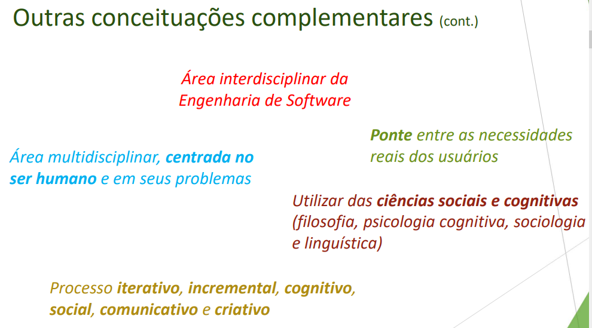

# Engenharia de requisitos

## Indrodução

- Parte da engenharia de software responsável pela compreensão dos problemas a serem solucionados e a definição de "o que" deve ser feito para solucioná-los.

- Ponte entre domínios de adquirente e do fornecedor ou desenvolvedor, visando estabelecer e manter requisitos a serem atendidos pelo sistema, software ou serviçõ de interesse.

## Foco

A engenharia de requisitos está focada em descobrir, desenvolver,
rastrear, analisar, qualificar, verificar, validar, comunicar, documentar e
gerenciar os requisitos de um software.

## Resultados

## Geral

- Análise do negócio
- Ser parte do ambiente de negócio
- Se colocar no lugar do cliente
- Domínio de negócio
